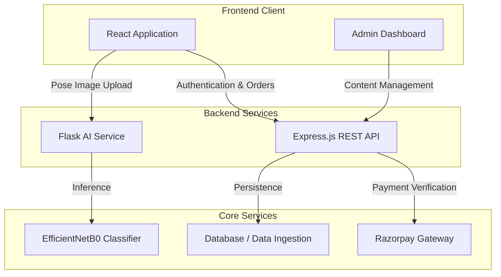

# Yogashrini

Yogashrini is a web application designed for yoga practice, featuring automated pose classification, video-based learning modules, retreat bookings, and an e-commerce platform for wellness products. The system combines a React frontend, a Node.js/Express API gateway, and a Python Flask microservice running an EfficientNetB0 computer vision model.

---

## Technical Stack

| Component | Technologies Used |
| :--- | :--- |
| **Frontend** | React 19, React Router v7, Bootstrap 5, Formik, Yup, Chart.js, React Icons |
| **Admin Panel** | React 19, Custom CSS, Bootstrap |
| **Backend API** | Node.js, Express.js |
| **Computer Vision Microservice** | Python 3.10+, TensorFlow 2.10, Flask, EfficientNetB0, NumPy, Pillow |
| **Integrations** | Razorpay SDK, RESTful API Architecture |
| **Data Ingestion** | Custom dataset scripts for pose definitions and course catalogs |

---

## Core System Features

- **Pose Evaluation Engine**: Uses a fine-tuned EfficientNetB0 convolutional neural network trained on 47 yoga pose classes. The microservice processes uploaded images via Flask, returning classification labels, confidence scores, top-5 predictions, and annotated visual outputs.
- **Course & Module Player**: Interactive video player interface for structured multi-week courses with progress tracking and enrollment status checks.
- **Payment & Enrollment Verification**: Integrates Razorpay API for order creation and HMAC SHA256 signature verification to handle course enrollments and product purchases.
- **E-Commerce & Retreat Management**: Dedicated modules for cataloging wellness items and managing retreat bookings.
- **Admin Control Panel**: Interface for managing course content, product listings, retreat schedules, and user records.

---

## Architecture Diagram



---

## Team & Responsibilities

| Contributor | Role | Key Contributions |
| :--- | :--- | :--- |
| **Anirban Sil** | Frontend & Database Engineer | Developed core React frontend components, posture evaluation interfaces, course players, and database seeding scripts for pose datasets. |
| **Suryendu Das** | Frontend Engineer | Implemented user authentication flows, input validation with Formik and Yup, product shop UI, and Chart.js integration. |
| **Abhiroop Mukherjee** | Backend Architect | Built the Express API server, developed the Python Flask microservice with EfficientNetB0 model integration, and implemented Razorpay verification. |
| **Amitasan Das** | Marketing & Research | Conducted market research on yoga posture education, user flow requirements, course curricula design, and product placement strategy. |

---

## Resume Bullet Points

### Anirban Sil (Frontend & Database Engineer)
- Designed and built user interface components using React 19, React Router v7, and Bootstrap for posture evaluation, video streaming, and dashboards.
- Developed database ingestion scripts to structure and populate dataset entries for 47 yoga pose categories and course structures.

### Suryendu Das (Frontend Engineer)
- Implemented client-side form handling and validation using Formik and Yup across authentication and booking workflows.
- Integrated Chart.js analytics for user progress tracking and built product catalog views for the e-commerce store.

### Abhiroop Mukherjee (Backend Architect)
- Engineered a dual-backend architecture using Express.js for REST services and Python Flask for deep learning inference.
- Fine-tuned an EfficientNetB0 model on 47 posture classes achieving 84.96% validation accuracy with automated image annotation pipelines.
- Integrated Razorpay payment API with server-side HMAC SHA256 signature verification.

### Amitasan Das (Marketing & Research)
- Executed domain research to define posture categorization schemas, course structures, and target user personas.
- Developed product strategy and marketing frameworks to align application features with user requirements.

---

## Repository Structure

```
yogashrini/
├── Frontend/         # React client application
├── Backend/          # Node.js Express REST API
├── Python Backend/   # Flask microservice and EfficientNetB0 model
├── Admin/            # React administration dashboard
└── README.md
```

---

## Setup & Local Execution

### 1. Prerequisites
- Node.js v18+
- Python 3.10+ with pip
- TensorFlow 2.10+

### 2. Installation

Clone the repository:
```bash
git clone https://github.com/Abhiroop001/yogashrini.git
cd yogashrini
```

#### Frontend Setup
```bash
cd Frontend
npm install
npm start
```
*Runs on `http://localhost:3000`*

#### Express Backend Setup
```bash
cd ../Backend
npm install
npm start
```
*Runs on `http://localhost:2000`*

#### Python Microservice Setup
```bash
cd "../Python Backend"
pip install flask flask-cors tensorflow pillow numpy
python app.py
```
*Runs on `http://localhost:5000`*

---

## API Summary

### Computer Vision API (`http://localhost:5000`)
- `GET /health` — Check service status and model parameters.
- `POST /predict` — Accept base64 image data and return predicted pose label, confidence score, top-5 probabilities, and annotated image output.
- `GET /classes` — List all 47 recognized pose classes.

### Backend API (`http://localhost:2000`)
- `POST /login` / `POST /signup` — User authentication routes.
- `GET /course` — Fetch course list.
- `POST /payment/create-order` — Generate Razorpay payment order ID.
- `POST /payment/verify` — Verify payment signature and complete enrollment.

---

## License

Distributed under the MIT License.
